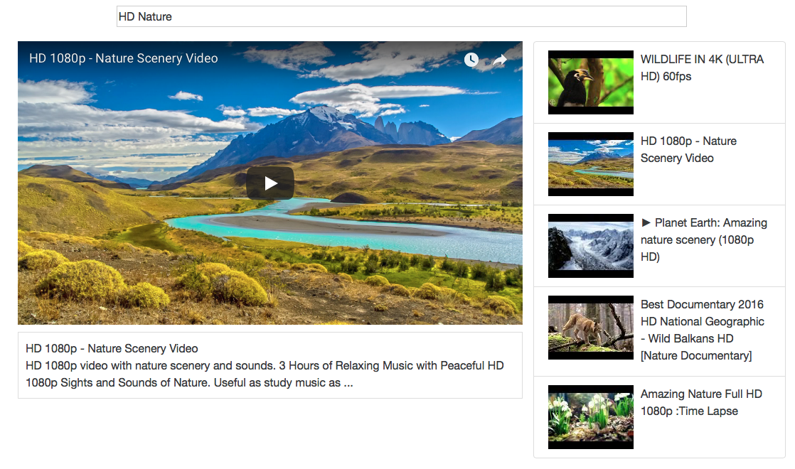

# MiniYoutube-ReactJS
> ReactJS app which fetches videos from youtube API and displays it to the user. The app has dynamic search bar which return result upon changing the search term.

MiniYoutube is a ReactJS app which fetches videos from youtube API, the user can play any video and can search for more videos. The app has dynamic search bar which return result upon changing the search term.

## Features

- [x] Play Video
- [x] List Videos
- [x] Search Videos

## Requirements

- NodeJS
- ReactJS

## Installation

#### Manually
1. Clone or Download the project.
2. npm install
3. npm start
4. Go to localhost:8080/

